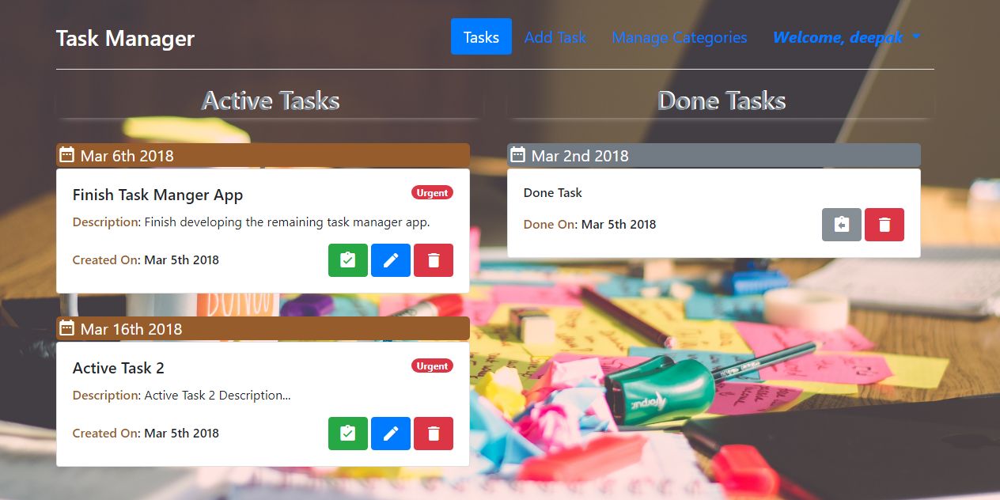
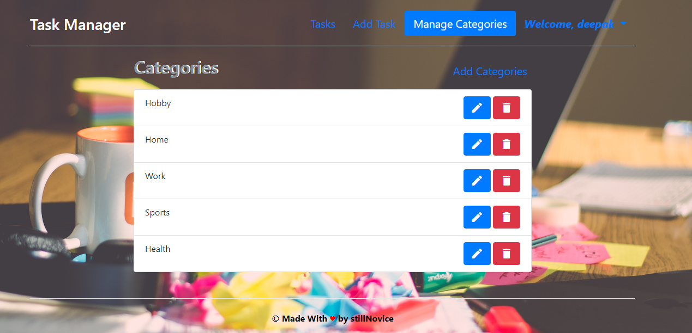

# Task-Manager
A Web app that manages your day to day task. Made With Love using Node.js, Express.js, Mongoose, MongoDB, mLab, Node-Mailer, Gmail-API, Passport.js, Express-Handlebars, Bootstrap, jQuery, HTML5 & CSS.

### Whats new here?
- User can create their personal accounts. (User-Authentication functionality).
- Users are send timely mails for various notifications. (Mailing functionality).

# Screenshots

# Usage
Open browser and go to the [Task-Manger-Link](http://ec2-13-127-109-80.ap-south-1.compute.amazonaws.com/) and Enjoy.

